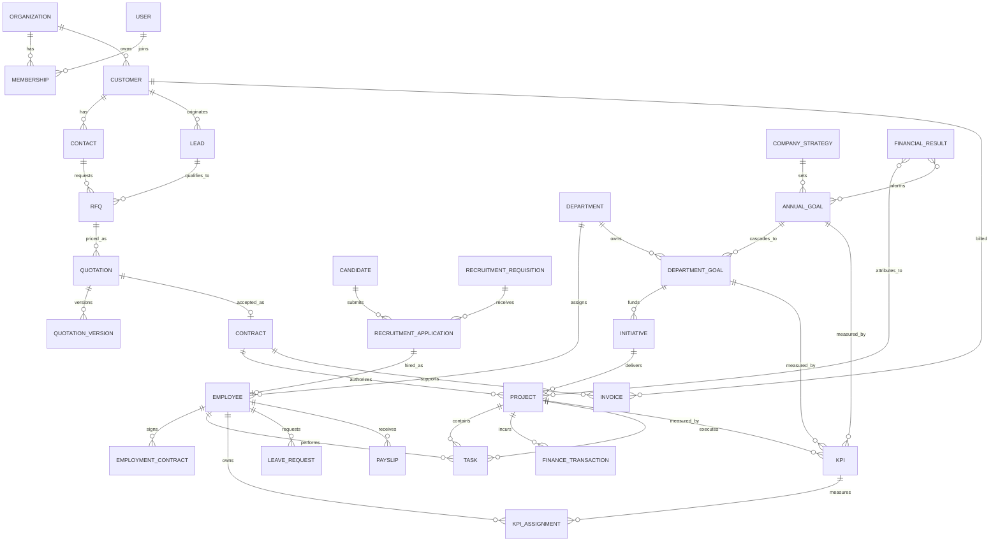

# Database Architecture

## Status and conventions

Implemented in Supabase on 15 September 2026 through the tracked migrations in `supabase/migrations/`:

- `202609150001_initial_betanor_platform.sql` establishes the core platform model.
- `202609150002_harden_rls_and_foreign_key_indexes.sql` adds explicit deny-by-default operational policies and foreign-key indexes.
- `202609150003_add_workflow_supporting_domains.sql` adds opportunities, public chat, reusable approvals, document links, vendors, positions, and calendar events.

The physical model uses `workspaces` as the tenant/company boundary, UUID primary keys, `timestamptz` audit timestamps, ISO-4217 currency codes, and `numeric(14,2)` money values. Every table in the exposed `public` schema has RLS enabled. Operational tables have no client grants and an explicit deny policy until their module-specific permission rules are implemented; service-role server workflows remain the only authorized integration path. Published CMS content is the sole anonymous read surface.

## Conceptual ERD

## Major relationship narratives

### Commercial delivery

`Customer → Lead → RFQ → Quotation → Contract → Project → Task → Finance` is a traceable funnel. A customer can have many leads; a qualified lead can produce RFQs; an RFQ can have multiple quotations and versions, but only an accepted quotation may create a contract. A contract may authorize one or more projects. Project tasks capture delivery effort and can link to approved costs, billable work, invoices, payments, and recognized financial results. Preserve a snapshot of accepted commercial terms so later customer or price changes cannot rewrite history.

### People lifecycle

`Candidate → Recruitment → Employee → Employment Contract → Department → Task → KPI → Leave → Payslip` represents the lifecycle, not a mandatory single linear chain. Candidates apply to requisitions through recruitment applications; a successful application creates or links an employee record. Employees can have multiple time-bounded employment contracts and department assignments. Tasks and KPI assignments tie performance to work. Leave requests affect payroll inputs; a payslip is a period-specific immutable payroll output.

### Strategy execution

`Company Strategy → Annual Goal → Department Goal → Initiative → Project → Task → KPI → Financial Result` aligns work to outcomes. Goals may have several KPIs, and KPIs may be assigned to people, teams, departments, projects, or initiatives. Financial results are periodized facts attributed through explicit allocation records, rather than assuming a one-to-one link.

## Supporting conceptual entities

- `approval_request`, `approval_step`, `approval_decision`: reusable approval workflow for quotations, expenses, leave, contracts, and plans.
- `attachment`, `document_template`, `generated_document`: files and versioned templates stored in Supabase Storage with metadata in Postgres.
- `conversation`, `message`, `rfq_intake`: chat ingestion and human-reviewed RFQ extraction.
- `expense_request`, `expense_line`, `budget`, `budget_allocation`, `finance_transaction`, `invoice`, `payment`.
- `audit_event`, `outbox_event`, `notification`, `comment`, `tag`.

## Implemented domain inventory

The implemented inventory covers identity/RBAC (`profiles`, roles, permissions, user-role joins); HR/recruitment/leave/payroll; strategy, goals, initiatives and KPIs; CRM, consultation and partner enquiries; RFQ, quotations and contracts; projects, milestones, tasks and comments; finance, budgets, expenses, invoices and payments; CMS content; and platform documents, notifications and audit events. The conceptual ERD above groups these implementation tables by bounded context.

Identifiers required by the master specification—`BTNR-CHAT-YYYY-XXXXX`, `BTNR-RFQ-YYYY-XXXXX`, `BTNR-QTN-YYYY-XXXXX`, `BTNR-CTR-YYYY-XXXXX`, `BTNR-EMP-YYYY-XXXXX`, and job application references—should be generated transactionally from organization/year sequences, protected by unique constraints, and never used as the sole authorization secret.

## Data integrity rules

- Enforce allowed state transitions in database functions or carefully permissioned transactional server operations.
- Accepted quotation version, signed contract version, and finalized payslip are immutable; corrective records supersede them.
- A project’s commercial linkage is optional only for internal projects and must be explicitly classified.
- A user identity, employee, candidate, customer contact, and vendor contact are distinct roles linked through a party/contact design if a shared-party abstraction is later approved.
- Avoid a universal polymorphic foreign key for core accounting links; use typed link tables for integrity and reporting.
- Financial management is operational/management finance, not a statutory-accounting replacement; approved records alone feed official financial KPIs.
