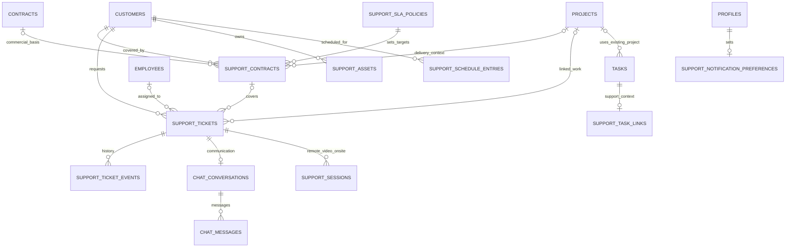
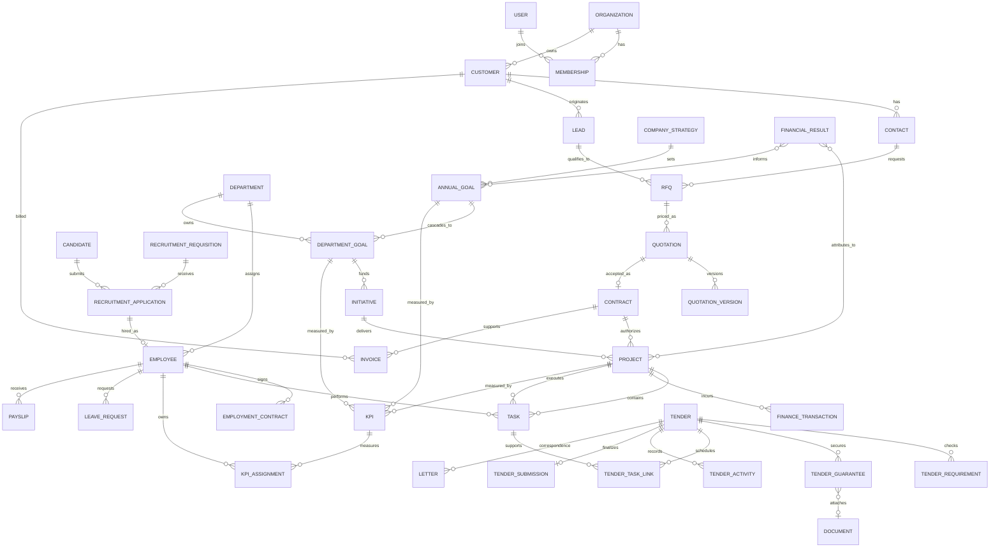
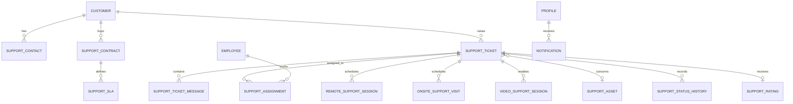

# Database Architecture

## Status and conventions

Implemented in Supabase on 15 September 2026 through the tracked migrations in `supabase/migrations/`:

- `202609150001_initial_betanor_platform.sql` establishes the core platform model.
- `202609150002_harden_rls_and_foreign_key_indexes.sql` adds explicit deny-by-default operational policies and foreign-key indexes.
- `202609150003_add_workflow_supporting_domains.sql` adds opportunities, public chat, reusable approvals, document links, vendors, positions, and calendar events.
- `202609150020_phase16_work_management.sql` enables authenticated Work-module access for tasks, assignees, comments, and delivery indexes.
- `202609150021_phase17_people_hr_recruitment.sql` adds automatic employee IDs, standard 8×5 workweek fields, business-day leave calculation, HR recruitment access, and the public application RPC.
- `202609150022_phase17_leave_two_step_guard.sql` ensures managers move leave to review while HR finalizes approval or rejection.
- `202609150023_people_workspace_resolution.sql` lets authorized global staff resolve the single Betanor workspace without exposing unrelated tenants.
- `202609150024_hr_employee_profile_linking.sql` allows HR to read eligible profiles for linking an employee to self-service portal access.
- `202609150025_phase18_finance_access.sql` adds configurable Ethiopian invoice VAT/TIN evidence, money integrity checks, finance permissions, and RLS-backed operational finance access.
- `202609150026_finance_workspace_resolution.sql`, `202609150027_finance_related_reads.sql`, and `202609150028_finance_employee_context.sql` allow finance staff to resolve the tenant and read only the project, department, customer, and requester context needed by finance screens.
- `202609220001_employee_account_provisioning.sql` adds the separate employee access lifecycle and temporary-password activation flag. The corresponding Auth/employee provisioning workflow lives in `supabase/functions/admin-user-management`.
- `202609220003_tender_management.sql` adds tenders, submission requirements, CPO/bank guarantees, tender-task links, activity history, and immutable final submission snapshots with RLS.
- `202609220004_profile_avatars.sql` adds the private `betanor-profile-avatars` Storage bucket and owner-scoped policies, reusing `profiles.avatar_path`.
- `202609220005_tender_immutability.sql` adds database triggers preventing updates/deletes to a submitted tender, its checklist, guarantees, task links, or final submission snapshot.
- `202609220006_tender_expiry_reminders.sql` is applied in production; it adds idempotent reminder events and a security-definer function for 14/7/3/1-day guarantee notifications, and schedules Supabase `pg_cron` at 06:00 UTC.

The physical model uses `workspaces` as the tenant/company boundary, UUID primary keys, `timestamptz` audit timestamps, ISO-4217 currency codes, and `numeric(14,2)` money values. Every table in the exposed `public` schema has RLS enabled. Finance now exposes only permission-scoped reads and writes for categories, vendors, budgets, expenses, invoices, invoice lines, payments, and expense approvals; unrelated callers remain blocked. Invoices retain configurable VAT rate, tax amount, tax-inclusive flag, supplier/customer TIN and VAT registration values, place of supply, payment terms, and Ethiopian governing-law evidence. Approved records are management-finance data and do not replace statutory fiscal invoicing.

## Conceptual ERD

### IT Support / Managed Support (production migration applied 2026-09-23)

`202609230001_it_support_managed_support.sql` adds the support service domain without a second customer, employee, task, document, chat, or notification identity model:

Tickets carry customer, optional existing commercial support contract/project, customer requester, and an optional assigned employee. Support conversations extend `chat_conversations` via `support_ticket_id`; messages, presence, private chat attachments and customer portal access remain in the existing chat system. Support tasks link to canonical `tasks`; documents are linked through existing `document_links`; in-app notifications use `notifications`, while email/Telegram requests are queued in a support outbox. No email/Telegram delivery worker is currently wired to that outbox, so those channels remain pending separate provider/worker configuration. `support_sessions` stores session metadata only: it does not create a video meeting or persist provider secrets. Lifecycle records describe customer IT joiner/leaver work and do not duplicate HR employee onboarding.

The RTSL demonstration uses canonical `customers` and `projects`, a demonstration support contract/SLA, example laptops/workstations, sample tickets/tasks/lifecycle checklists, and a Thursday 09:00–12:00 `Africa/Addis_Ababa` visit entry. Demo customer/project rows are idempotently seeded by the migration. Supabase Auth identities and credentials must be provisioned through the existing protected user-management workflow, never by SQL.

## Major relationship narratives

### Commercial delivery

`Customer → Lead → RFQ → Quotation → Contract → Project → Task → Finance` is a traceable funnel. A customer can have many leads; a qualified lead can produce RFQs; an RFQ can have multiple quotations and versions, but only an accepted quotation may create a contract. A contract may authorize one or more projects. Project tasks capture delivery effort and can link to approved costs, billable work, invoices, payments, and recognized financial results. Preserve a snapshot of accepted commercial terms so later customer or price changes cannot rewrite history.

### People lifecycle

`Candidate → Recruitment → Employee → Employment Contract → Department → Task → KPI → Leave → Payslip` represents the lifecycle, not a mandatory single linear chain. Candidates apply to requisitions through recruitment applications; a successful application creates or links an employee record. Employees can have multiple time-bounded employment contracts and department assignments. Tasks and KPI assignments tie performance to work. Leave requests affect payroll inputs; a payslip is a period-specific immutable payroll output.

An employee is not an Auth user. `auth.users` owns credentials; `profiles` owns application identity; `employees` owns HR data. `employee_access` is a one-to-one, auditable bridge (`employee_id` + `profile_id`) with provisioning method, activation state, invitation timestamps, and suspension/end dates. `profiles.password_change_required` is a control flag only; no password or reset token is stored in PostgreSQL.

### Strategy execution

`Company Strategy → Annual Goal → Department Goal → Initiative → Project → Task → KPI → Financial Result` aligns work to outcomes. Goals may have several KPIs, and KPIs may be assigned to people, teams, departments, projects, or initiatives. Financial results are periodized facts attributed through explicit allocation records, rather than assuming a one-to-one link.

## Supporting conceptual entities

- `approval_request`, `approval_step`, `approval_decision`: reusable approval workflow for quotations, expenses, leave, contracts, and plans.
- `attachment`, `document_template`, `generated_document`: files and versioned templates stored in Supabase Storage with metadata in Postgres.
- `conversation`, `message`, `rfq_intake`: chat ingestion and human-reviewed RFQ extraction.
- `expense_request`, `expense_line`, `budget`, `budget_allocation`, `finance_transaction`, `invoice`, `payment`.
- `audit_event`, `outbox_event`, `notification`, `comment`, `tag`.

## Tender management domain

`tenders` is the bounded tender register. Each tender owns a mandatory/optional
submission checklist, one or more security records (`tender_guarantees`), links
to existing `tasks` through `tender_task_links`, and an activity timeline. A
submission letter is an existing `letters` row linked by `letters.tender_id`;
the tender does not duplicate the correspondence model. `tender_submissions`
stores one immutable final snapshot and SHA-256 content hash per tender. The
database unique constraint prevents two references within one workspace and
the unique tender submission constraint prevents a second final submission.
Guarantee expiry, responsible-user, tender deadline, and status indexes support
the role dashboards without loading the full register.

Payroll edits remain in the existing `payroll_cycles`/`payslips` model. The
application spreadsheet editor updates only draft/submitted, unpublished slips;
published cycles remain protected by the existing payroll transition/RLS rules.

## Implemented domain inventory

The implemented inventory covers identity/RBAC (`profiles`, roles, permissions, user-role joins); HR/recruitment/leave/payroll; strategy, goals, initiatives and KPIs; CRM, consultation and partner enquiries; RFQ, quotations and contracts; projects, milestones, tasks and comments; finance, budgets, expenses, invoices and payments; CMS content; and platform documents, notifications and audit events. The conceptual ERD above groups these implementation tables by bounded context.

Identifiers required by the master specification—`BTNR-CHAT-YYYY-XXXXX`, `BTNR-RFQ-YYYY-XXXXX`, `BTNR-QTN-YYYY-XXXXX`, `BTNR-CTR-YYYY-XXXXX`, `BTNR-EMP-YYYY-XXXXX`, and job application references—should be generated transactionally from organization/year sequences, protected by unique constraints, and never used as the sole authorization secret.

## Data integrity rules

- Enforce allowed state transitions in database functions or carefully permissioned transactional server operations.
- Accepted quotation version, signed contract version, and finalized payslip are immutable; corrective records supersede them.
- A project’s commercial linkage is optional only for internal projects and must be explicitly classified.
- A user identity, employee, candidate, customer contact, and vendor contact are distinct roles linked through a party/contact design if a shared-party abstraction is later approved.
- Avoid a universal polymorphic foreign key for core accounting links; use typed link tables for integrity and reporting.
- Financial management is operational/management finance, not a statutory-accounting replacement; approved records alone feed official financial KPIs.

## Identity and communication extensions

The control plane adds `profiles.account_type` and `roles.role_type` to keep staff and customer identities distinct. `user_permissions(user_id, permission_id, is_allowed)` is an explicit override layer above role bundles; a false row revokes a role-derived capability and an absent row falls back to the role. A customer account receives a customer role plus a `customer_portal_access` row, while a staff account may optionally be provisioned with an `employees` row using the Betanor 8-hours-per-day, Monday-to-Friday schedule.

Auth administration is intentionally not a public table operation. The `admin-user-management` Supabase Edge Function validates the caller, uses the server-only service key to create/update/delete `auth.users`, writes the linked profile and role, provisions customer/employee records, and appends an `audit_events` record. Auth UUIDs are therefore generated by Supabase and returned to the administrator only after a successful transaction.

`chat_conversations` serves both support and internal collaboration. Customer conversations have `customer_id`; internal conversations leave it null. Each internal message is marked `is_internal`, and customer policies allow only non-internal messages for their own customer. Realtime publication on conversations/messages keeps both inboxes current without sharing private staff notes.

## Support domain (planned Phases B–H)

Support extends the canonical customer instead of creating a second customer identity:

Planned tables are `support_contacts`, `support_contracts`, `support_slas`, `support_tickets`, `support_ticket_messages`, `support_ticket_internal_notes`, `support_ticket_attachments`, `support_assignments`, `support_status_history`, `support_escalations`, `remote_support_sessions`, `onsite_support_visits`, `video_support_sessions`, `support_assets`, `support_kb_articles`, `support_kb_categories`, and `support_ratings`. They must reference existing `customers`, `employees`, `contracts`, `projects`, and `notifications`; do not create duplicate customer or staff identity tables.

Support ticket numbers (`BTNR-TKT-YYYY-XXXXX`) and guest request numbers (`BTNR-SUP-YYYY-XXXXX`) must be generated by server-side sequences/RPCs. Customer-facing policies must be tenant- and portal-access-scoped; internal notes and staff assignments must never be readable by customer roles.
